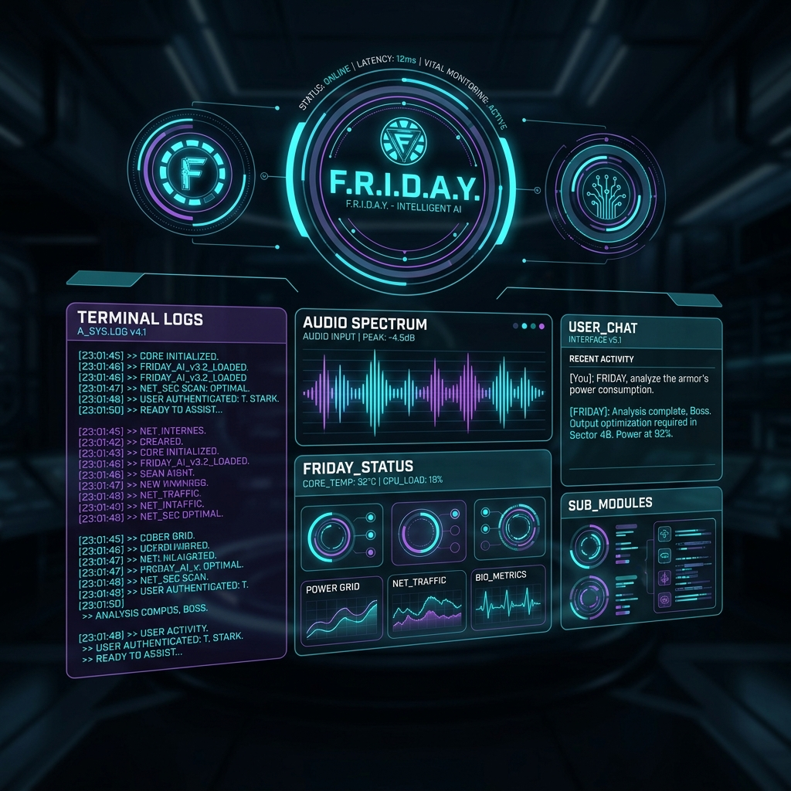

# F.R.I.D.A.Y. - Personal AI Assistant (Gemini Only Stack)

FRIDAY (Female Replacement Intelligent Digital Assistant Youth) is a voice-first personal AI assistant for Windows, inspired by Marvel's JARVIS/FRIDAY. It is built with a FastAPI backend, a sleek holographic glassmorphic UI dashboard, ChromaDB for semantic long-term memory, and SQLite for chat log history.

This stack is configured to make **Google Gemini the sole required AI provider**. All speech-to-text is executed locally offline.



## Core Features (Phase 1)
- **Primary AI Brain & Embeddings**: Powered by Google Gemini (`gemini-2.5-flash`), with system instruction control, chat history tracking, and active tool calling.
- **Voice Input**: Local, offline Speech-to-Text via **`faster-whisper`** (loads a CPU-optimized `tiny` model locally using `int8` quantization for maximum speed and efficiency). Falls back to browser-native voice recognition if microphone access is limited.
- **Voice Output**: Natural-sounding English voice via `edge-tts` (using `en-GB-SoniaNeural` for an elegant British accent).
- **Persistent Memory**: SQLite database for sequential conversation history and ChromaDB vector store for long-term user facts and preferences.
- **Desktop HUD Interface**: A gorgeous, holographic, responsive Web-based desktop dashboard with real-time diagnostics, system console logs, sound waves visualizer, and hold-to-talk mic button.

---

## Folder Structure

```
C:\Users\visha\friday\
├── app/
│   ├── __init__.py
│   ├── main.py                # FastAPI endpoints & static routing
│   ├── config.py              # Env configuration and log handlers
│   ├── brain/
│   │   ├── __init__.py
│   │   ├── agent.py           # Gemini interaction, system prompt, tool calling
│   │   └── memory.py          # SQLite chat database & ChromaDB vector memory
│   ├── voice/
│   │   ├── __init__.py
│   │   ├── stt.py             # Local faster-whisper STT transcriber
│   │   └── tts.py             # edge-tts voice generator
│   └── gui/
│       ├── static/
│       │   ├── css/
│       │   │   └── style.css  # Futuristic glassmorphic HUD CSS
│       │   └── js/
│       │       └── main.js    # Hold-to-talk recording, Web Speech STT fallback, TTS, and core animations
│       └── templates/
│           └── index.html     # Interactive dashboard HTML
├── tests/                     # Pytest suite
│   ├── __init__.py
│   ├── test_brain.py
│   ├── test_memory.py
│   └── test_voice.py
├── requirements.txt           # Project dependencies
├── .env.example               # Environment variables configuration example
├── run.py                     # Convenience startup script (launches server and browser)
└── architecture.md            # Technical architecture documentation
```

---

## Setup Guide

### Prerequisites
1. **Python 3.10+** installed on your system.
2. A **Google Gemini API Key** (to power the AI brain and generate database embeddings). Get one from Google AI Studio.
3. No OpenAI credentials needed! All transcription runs locally.

### Installation

1. Clone or download the directory to `C:\Users\visha\friday`.
2. Open a terminal in the folder and create a virtual environment:
   ```bash
   python -m venv venv
   ```
3. Activate the virtual environment:
   - **Windows PowerShell**:
     ```powershell
     .\venv\Scripts\Activate.ps1
     ```
   - **Windows Command Prompt (CMD)**:
     ```cmd
     .\venv\Scripts\activate.bat
     ```
4. Install dependencies:
   ```bash
   pip install -r requirements.txt
   ```
5. Copy `.env.example` to `.env` and fill in your Gemini API key:
   ```env
   GEMINI_API_KEY=your_google_gemini_api_key
   ```

---

## Running the Application

Start the assistant using the runner script:
```bash
python run.py
```
This script will start the FastAPI backend server on `http://127.0.0.1:8000` and automatically open your default browser to launch the FRIDAY HUD interface. On the first voice transcription request, the backend will download the tiny local Whisper model (~39MB) to perform local offline transcriptions.

### UI Controls
- **Chat Input**: Type your instructions and press Enter (or click the Send button).
- **Hold-to-Talk Button**: Click and hold the `HOLD TO TALK` button to record your voice locally. Release it to transmit and transcribe locally.
- **Purge Memory Button**: Wipes the ChromaDB memory and SQLite chat logs for a clean slate.
- **Core Reactor Core**: Click the glowing reactor core at any time to mute/stop playing TTS speech responses immediately.

---

## Running Tests

Execute the automated test suite with pytest:
```bash
pytest
```
All tests run locally offline using mocked voice/brain pipelines.
