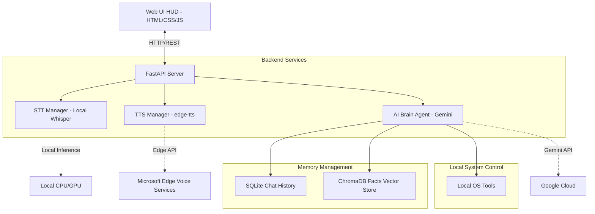
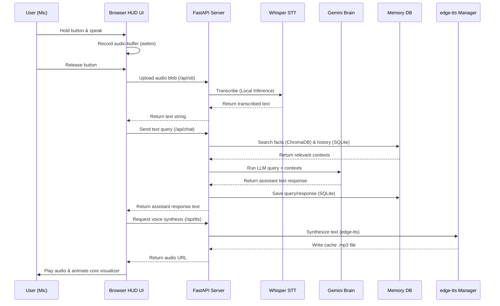
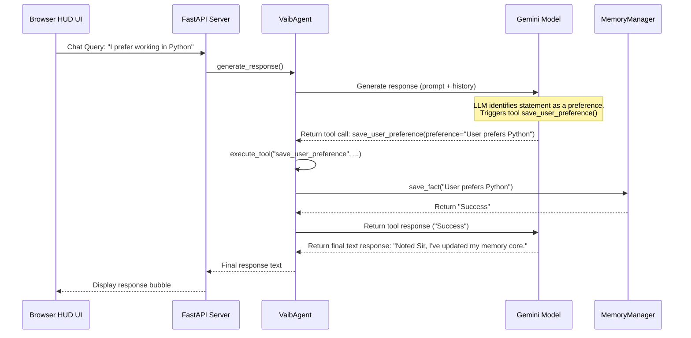

# V.A.I.B. - Architecture Design Documentation

This document outlines the software architecture and component design of V.A.I.B. (Virtual Artificial Intelligence Brain), a voice-first, modular, personal AI assistant.

---

## 1. System Overview

V.A.I.B. uses a multi-tier modular architecture designed for high responsiveness, low-latency voice interactions, and local system integration.

The design comprises four primary layers:
1. **Presentation Layer (Web UI HUD)**: Served locally via FastAPI. Handles microphone recording, audio playback, HUD animations, chat display, and diagnostics.
2. **Application Layer (FastAPI Backend)**: Orchestrates endpoints for chat, text-to-speech, speech-to-text, status metrics, and static asset serving.
3. **Cognitive Layer (Brain & Memory)**: Evaluates user input using Google Gemini 2.5 Flash. Integrates tool execution, semantic memory retrieval (ChromaDB), and chronological logs (SQLite).
4. **Integration Layer (Voice & OS Tools)**: Direct interfaces for speech synthesis, microphone transcription, and system operations.

---

## 2. Core Components

### 2.1 The Memory System (`app/brain/memory.py`)
To mimic human-like persistent memory, V.A.I.B. splits storage into two distinct components:
- **Short-Term Conversation Logs (SQLite)**: Sequential table storing chat history. This ensures that multi-turn dialogue contexts are injected in correct chronological order.
- **Long-Term Fact Database (ChromaDB)**: Vector database that indexes user facts and preferences (e.g., favorite applications, user schedule, named entities). Utilizes Gemini embeddings (`gemini-embedding-001`) to run semantic searches against queries and inject relevant context into the LLM prompt.

### 2.2 The Cognitive Brain (`app/brain/agent.py`)
The reasoning engine utilizes `gemini-2.5-flash` due to its high speed, tool-calling competence, and huge context window.
- **Custom System Instruction**: Defines the V.A.I.B. persona, witty tone, and Windows operating context.
- **Context Injection**: Dynamically loads facts from ChromaDB and recent turns from SQLite for every user prompt.
- **Tool-Calling Loop**: Binds local python functions (e.g., memory saving, OS status check) as LLM tools. If the model triggers a tool call, the agent pauses text generation, executes the function locally, feeds the results back to the model, and recursively continues until the final text response is produced.

### 2.3 The Voice Managers (`app/voice/`)
- **Speech-to-Text (`stt.py`)**: Runs local offline inference on recorded voice binaries using the `faster-whisper` library. Loads the optimized `tiny` model locally using CPU `int8` quantization. Features a browser-native Web Speech API fallback on the frontend as an alternative.
- **Text-to-Speech (`tts.py`)**: Integrates Microsoft's free `edge-tts` engine. Generates high-fidelity audio streams matching natural human pitch (`en-GB-SoniaNeural` voice), saving them to a local cache directory served via FastAPI.

### 2.4 Presentation Layer (`app/gui/`)
The visual dashboard replicates a holographic HUD using HTML5, CSS3, and JavaScript:
- **Web Audio Playback**: Audio bytes are decoded and played using standard HTML5 `<audio>` tags. This enables real-time interruption (muting) and waveform synchronization.
- **Glassmorphism Styling**: Blends glass panels with cybernetic gradients (`#00f0ff` cyan, `#bd00ff` violet) and CSS3 keyframe animations (rotating HUD rings, pulsing glowing cores).
- **Dual-Mode Voice Capturing**: Features a Hold-to-Talk button using `MediaRecorder` to capture micro-audio, with web-speech translation fallback.

---

## 3. Data Flows

### 3.1 Voice Chat Interaction Flow

### 3.2 Cognitive Memory Tool Execution Flow

---

## 4. Error Handling and Resiliency

-- **API Offline Mitigation**: If the Gemini API key is missing or internet connections are down, the agent fails gracefully, logging details to `vaib.log` and warning the user through the HUD diagnostics panel.
-- **Microphone Fallback**: If the browser mic access is denied or local transcription fails, the UI automatically initiates local browser-native Web Speech recognition (`webkitSpeechRecognition`) to prevent locking user inputs.
-- **Audio Overlap Interruption**: The frontend monitors voice outputs. If the user transmits a new text message or clicks the central core reactor while VAIB is speaking, the HTML5 media stream is paused instantly, and the core returns to standby status.
