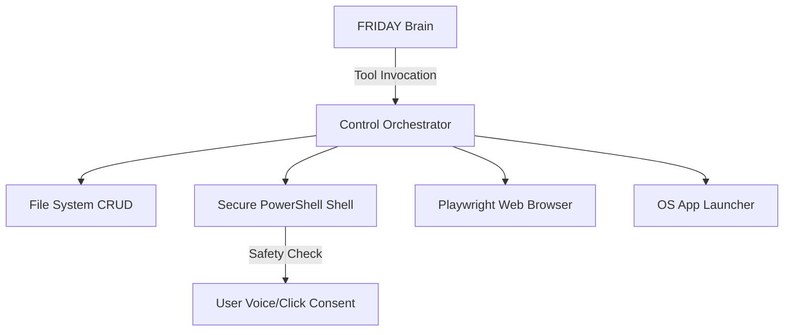

# F.R.I.D.A.Y. - Future Roadmap (Phase 2 & Phase 3)

Following the successful completion of **Phase 1 (Brain & Memory Core)**, this document outlines the developmental path for subsequent phases.

---

## Phase 2: Computer Control & Automation (Milestones)

The objective of Phase 2 is to give FRIDAY hands-on capabilities to manipulate files, run commands, and automate web interactions.



### 1. Secure Shell Execution
- **Features**: Implement a tool allowing FRIDAY to execute command-line scripts in Windows PowerShell.
- **Security Checkpoints**:
  - Integrate a safety policy. Any system-modifying or terminal command requires explicit user confirmation (via a pop-up prompt in the HUD or a voice confirmation loop like "Yes, proceed").
  - Blacklist dangerous commands (e.g., formatting drives, clearing system registries).

### 2. File Explorer Operations
- **Features**: Give the brain tools to manage files.
  - `list_directory(path)`: Scan files.
  - `read_file(path)`: Analyze local text/code.
  - `write_file(path, content)`: Generate reports, scripts, or notes.
  - `delete_file(path)`: Clean up workspaces (requires confirmation).

### 3. Playwright Browser Control
- **Features**: Full web automation stack.
  - Launch headless or headful chromium instances.
  - Search engines, fetch document pages, click buttons, and log in to mock portals.
  - Extract structured page text and feeds to synthesize summaries.

### 4. Windows Application Launcher
- **Features**: Open system executables (e.g., Notepad, Chrome, Calculator, VS Code) using Python's `subprocess` module by mapping simple spoken commands (e.g., "FRIDAY, open Notepad").

---

## Phase 3: Productivity & Extensible Plugins (Milestones)

The objective of Phase 3 is to make FRIDAY a powerful daily productivity partner with an extensible plugin architecture.

### 1. Vision & Screen OCR
- **Webcam Support**: Capture frames from local camera input using OpenCV to analyze items or recognize the user.
- **Screen Capturing**: Take active screenshots of the Windows desktop.
- **OCR Engine**: Parse screenshots/documents using Gemini Vision or `pytesseract` to extract code, read active errors, or answer questions about what's currently on the user's screen.

### 2. Productivity Integrations
- **Reminders / Alarm Scheduler**: Implement background task timers that trigger speech warnings or notifications.
- **Calendar & To-do manager**: Manage a local sqlite database representing scheduling logs, drafting daily schedules.
- **Email Drafter**: Formulate SMTP drafts or integrate API endpoints to read headers.

### 3. Modular Plugin Architecture
- **Plugin Loader**: Allow developers to extend FRIDAY's tools by dropping custom python scripts into a `/plugins/` folder.
- **Dynamic Bindings**: Auto-discover tools marked with custom decorators (e.g., `@friday_tool`) and bind their schemas dynamically to the Gemini GenerativeModel at server startup.

---

## 4. Next Actions
1. **Approve Phase 2 plan**.
2. Initialize Playwright inside virtual environment:
   ```bash
   .\venv\Scripts\playwright install chromium
   ```
3. Implement `app/tools/computer.py` (Shell and Launcher).
4. Implement `app/tools/browser.py` (Playwright Browser controller).
