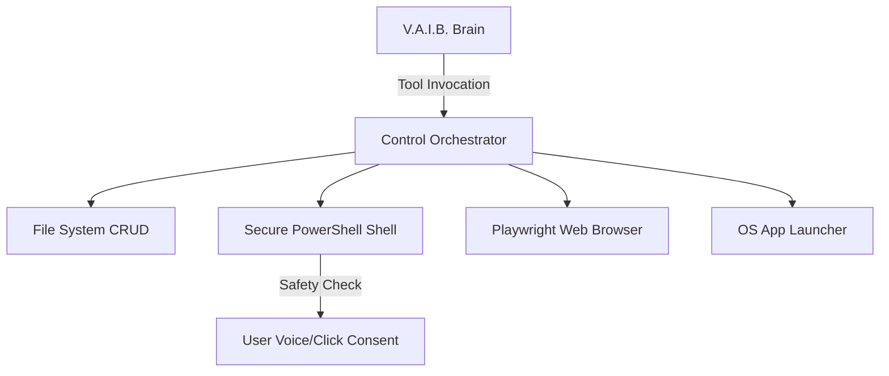

# V.A.I.B. - Future Roadmap (Phase 2 & Phase 3)

Following the successful completion of **Phase 1 (Brain & Memory Core)**, this document outlines the developmental path for subsequent phases.

---

## Phase 2: Computer Control & Automation (Milestones)

The objective of Phase 2 is to give V.A.I.B. hands-on capabilities to manipulate files, run commands, and automate web interactions.

### 1. Secure Shell Execution
- **Features**: Implement a tool allowing V.A.I.B. to execute command-line scripts in Windows PowerShell.
- **Security Checkpoints**:
  - Integrate a safety policy. Any system-modifying or terminal command requires explicit user confirmation (via a pop-up prompt in the HUD or a voice confirmation loop like "Yes, proceed").
  - Blacklist dangerous commands (e.g., formatting drives, clearing system registries).

### 2. File Explorer Operations
- **Features**: Give the brain tools to manage files.
  - `list_directory(path)`: Scan files.
  - `read_file(path)`: Analyze local text/code.
  - `write_file(path, content)`: Generate reports, scripts, or notes.
  - `delete_file(path)`: Clean up workspaces (requires confirmation).

### 3. Playwright Browser Control
- **Features**: Full web automation stack.
  - Launch headless or headful chromium instances.
  - Search engines, fetch document pages, click buttons, and log in to mock portals.
  - Extract structured page text and feeds to synthesize summaries.

### 4. Windows Application Launcher
- **Features**: Open system executables (e.g., Notepad, Chrome, Calculator, VS Code) using Python's `subprocess` module by mapping simple spoken commands (e.g., "Hey VAIB, open Notepad").

---

## Phase 3: Productivity & Extensible Plugins (Milestones)

The objective of Phase 3 is to make V.A.I.B. a powerful daily productivity partner with an extensible plugin architecture.

### 1. Vision & Screen OCR
- **Webcam Support**: Capture frames from local camera input using OpenCV to analyze items or recognize the user.
- **Screen Capturing**: Take active screenshots of the Windows desktop.
- **OCR Engine**: Parse screenshots/documents using Gemini Vision or `pytesseract` to extract code, read active errors, or answer questions about what's currently on the user's screen.

### 2. Productivity Integrations
- **Reminders / Alarm Scheduler**: Implement background task timers that trigger speech warnings or notifications.
- **Calendar & To-do manager**: Manage a local sqlite database representing scheduling logs, drafting daily schedules.
- **Email Drafter**: Formulate SMTP drafts or integrate API endpoints to read headers.

### 3. Modular Plugin Architecture
- **Plugin Loader**: Allow developers to extend V.A.I.B.'s tools by dropping custom python scripts into a `/plugins/` folder.
- **Dynamic Bindings**: Auto-discover tools marked with custom decorators (e.g., `@vaib_tool`) and bind their schemas dynamically to the Gemini GenerativeModel at server startup.

---

## Phase 4: Advanced Voice Assistant & Stabilization (Milestones)

The objective of Phase 4 is to transition V.A.I.B. into an automated, natural voice partner with continuous monitoring, event-driven components, and enterprise-level reliability.

### 1. Continuous Listening & VAD (Phase 4D)
- **Wake Word Detection**: Background recording scans for "Hey VAIB" or "VAIB" using fast boundary-matching regex.
- **Voice Activity Detection (VAD)**: Real-time client-side RMS volume analyzer automatically starts/stops audio segments.
- **Continuous Mode**: Stays awake, processing consecutive queries without wake words, and automatically enters standby after 30 seconds of inactivity.
- **Vocal Interruption (Interruptible TTS)**: Instantly silences Edge-TTS playback upon detecting user speech, shifting to active record/listening mode.
- **Holographic Voice HUD**: States (`Idle`, `Listening`, `Processing`, `Speaking`) visual feedback.
- **Decoupled Architecture**: Fully isolated STT, LLM, and TTS pipelines driven by custom event emitters.

### 2. Security Hardening & Multi-LLM Preparation (Phase 4E)
- **Security Audit & Trail**: Shell execution blacklists, file extension validators, and secure browser launch flags.
- **Multi-LLM Preparation**: Abstracted agent clients supporting Gemini (native), OpenAI, Anthropic, or Local Ollama models using provider-based configs.
- **Documentation & Walkthrough**: Automated verification integration reports and detailed guides.

---

## Phase 5: Real-Time Conversational Assistant

The objective of Phase 5 is to transition from turn-based (VAD file-blob sending) to true real-time, low-latency streaming.

### Key Milestones:
1. **WebSocket Audio Streaming**: Continuous streaming of raw PCM chunks from client to server.
2. **Streaming STT & TTS**: Real-time word-by-word transcription and streaming audio playback.
3. **Turn-Taking Protocol**: Asynchronous negotiation to handle simultaneous talking and interruption protocols over duplex channels.

